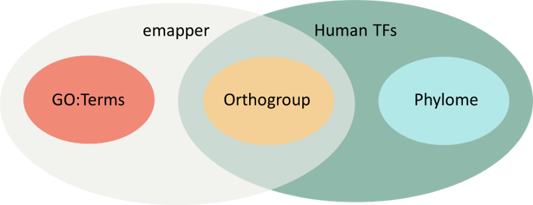

# Geneannotator

In v0.0.1 there are three separate but complementary pipelines to annotate the function of any gene/protein of your interest, using some publicly available resources. These resources are [Egggnog](http://eggnog5.embl.de/#/app/home), [emapper](http://eggnog-mapper.embl.de/) and the Phylome, all resources made and mantained by the Jaime Huerta Cepas lab in the CBGP unit of Universidad Politécnica de Madrid.

If you want to know more about each pipeline, check out the vignettes in the github repository.

# Installation

## pip install
The easiest way is just running on your terminal
```
pip install geneannotator
```

## Manual installation

If you don't already have one, create a Conda / Miniconda environment:
```
conda create -n geneannotator -c conda-forge python=3.7 pip pandas numpy
```

Install geneannotator
```
git clone https://git.embl.de/burgoa/geneannotator.git 
cd geneannotator
pip install .
```
